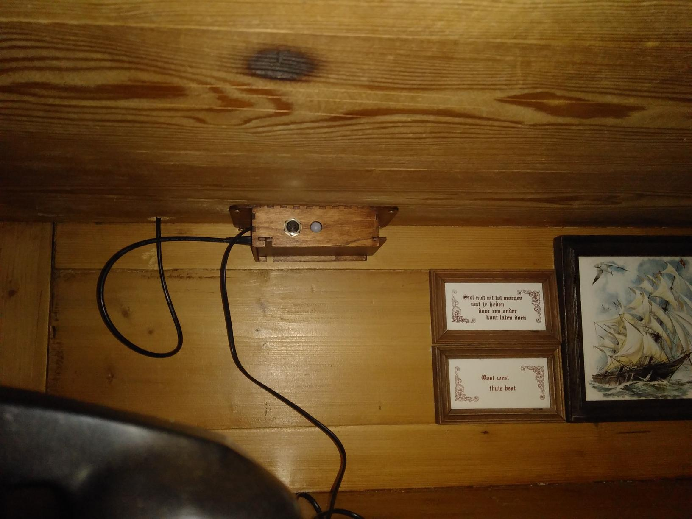
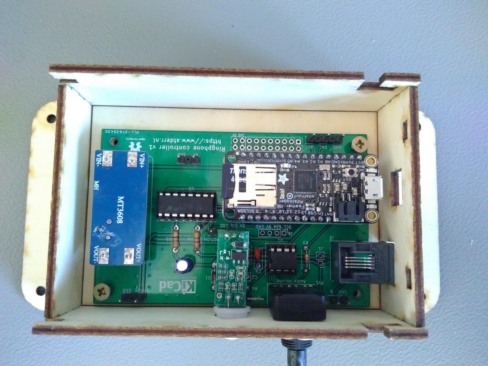

Vintage phone audio player
==========================
This is the Ringphone project, a device that allows using old (mechanical
ring) phones to be used as a random audio player.

Repo status: Design is completely published, documentation is not
complete yet (mostly casing and firmware is lacking, harware is
documented well). Case design might not work as-is, but need some
changes to work with the latest boxes.py.

This project was created to facilitate the "Onze Kast" ("Our Cabinet")
project, which is a cabinet created by and for demented elderly people
with all kinds of things to explore and experience. In this cabinet,
there is an old bakelite phone that rings when someone approaches and
plays random audio samples when picked up. This repository documents the
design of this phone and contains all the needed source code and design
files to build it.

[More images...](./Images)

This project consists of three parts:
 - The electronics to connect to the telephone and detect motion.
 - The software to control everything.
 - A lasercut wooden case to house the electronics.

The sources and design files for these parts can be found in the `PCB`,
`RingPhoneSketch` and `Case` directories respectively. The `Data`
directory contains a template for the contents of the SD card.

This project uses an unmodified phone, connecting to it using the two
wires that normally connect to the telephone line (in essence, the
electronics emulate a telephone line). In theory it should be able to
work with any analog landline phone, though I have only tested it with
Dutch rotary dial phones from the sixties (and since the voltage and
current capability are not as high as true landlines, some phones might
not work).

Features
--------
Electronically, this project supports:
 - Making the phone ring.
 - Making the phone play a sound (through its regular earpiece).
 - Reading the rotary dial (this is supported electronically, but not by
   the software yet).
 - Detecting motion (using a standard motion detector module).

Receiving audio from the microphone is not supported at all.

The software supports:
 - Ringing the phone when motion is detected (with a fixed cooldown to
   not keep ringing all the time while motion is detected).
 - Playing a random sound whenever the phone is taken off-hook (also
   when it was not ringing).
 - Playing an "end of conversation" tone when the audio file completes
   playing.
 - Playing a new random sound whenever the rotary dial is used (this
   happens automatically, since using the rotary dial looks like putting
   the phone on-hook again).

Sketch
------
This sketch includes a copy of the
[AudioZero](https://github.com/arduino-libraries/AudioZero/) library,
modified to allow playing an audio file in the background. I considered
doing this properly (e.g. create a pull request for the library, maybe
use DMA for extra efficiency, etc.), but then it would probably be
better to add DAC out support to the
[ArduinoSound](https://github.com/arduino-libraries/ArduinoSound)
library instead (which was a bit more work than I was willing to invest
now).

Adding audio samples
--------------------
To add audio samples, they first must be encoded properly. The AudioZero
library is rather picky with the format and only understands 8-bit
unsigned 44.1kHz mono raw PCM files. This means the file just contains
the raw audio samples concatenated, without any header or other
accompanying information. Each sample is simply an 8-bit unsigned
integer. Note that this is even more raw than `.wav` file, which
typically have a header that describes the sample format in front of the
raw samples. This means that normal audioplayers cannot actually play
these raw PCM files, since they have no idea what format the samples are
in.

To encode these files, you can use Audacity. After loading a file, make
sure it is mono and has 44.1kHz sampling rate, then export it through
"File" -> "Export" -> "Export Audio..." and choose for "Other
uncompressed files" and then "Header: RAW (header-less)" and "Encoding:
Unsigned 8-bit PCM". Alternatively, you can convert to `.sou` files
using [this website](https://convertio.co/nl/sou-converter), but you
probably need to convert to 44.1Khz mono beforehand.

Once encoded, adding them is rather easy: Just dump the files onto the
μSD card. Make sure to use a `.raw` or `.sou` extension and to put the
files in the root (i.e. not in a subdirectory) of the μSD card.

Special sample file
-------------------
On the SD-card there should be a directory called `special` containing a
single file called `end.raw`. This is a sample (encoded as above), which
is played once after a normal sample has finished playing.

PCB
---
https://github.com/KiCad/kicad-symbols/pull/1933
https://github.com/KiCad/kicad-footprints/pull/1657

Electronics
-----------
Electronically a (Dutch) landline roughly works as follows:
 - A line consists of 2 connections, labeled "a" and "b" (which are
   interchangeable). There are some additional connections for extra
   bells and advanced features, but it seems those are often not used or
   even supported.
 - In idle, there is around 60V DC present on the line and little to no
   current flows (historically generated using lead-acid batteries, so
   48V is also common).
 - When ringing, a 100Vpp 25Hz AC voltage is superimposed on top of the
   DC voltage, which will make the bell ring.
 - When phone is on-hook, only a bell and capacitor (in series) are
   connected between the phone line a and b lines. The DC idle voltage
   is blocked by the capacitor and no current flows. The AC ringing
   voltage is passed by the capacitor and makes the bell ring. The
   frequency of the ringing signal directly controls the movement of the
   bell hammer and thus the sound.
 - When the horn is lifted, the bell is removed from the line and a
   microphone and speaker are connected to the line (along with a
   transformer and other supporting components). When this happens, the
   DC resistance of the phone drops, more DC current (about 50mA) flows
   (through the speaker and microphone) and the line voltage drops (to
   something like 15VDC). This extra current can be detected by the
   phone central (originally by a relay coil connected in series that
   would switch when the current was high enough), to initiate a
   connection.
 - All of this is operated using balanced signals, meaning that the
   impedance / resistance of both lines is the same (as opposed to
   single-ended, where one line is grounded and the other carries the
   signal). This balanced impedance causes any noise to be picked up by
   both lines equally and allows the receiving end to cancel out the
   noise against itself, which is especially important when phone lines
   get longer and wired close together.

This same system is used pretty much everywhere, though some details and
voltage might differ from country to country.

I have found [a very good article][telefoonlijn] that describes this (in
Dutch, but the illustrations should be insightful even when you do not
speak Dutch).

Here's some other documentation about telephones and telephone lines:
 - [Telephone line audio interface circuits](http://www.epanorama.net/circuits/teleinterface.html)
 - [Telephone ringing circuits](http://www.epanorama.net/circuits/telephone_ringer.html)
 - [electrical characteristics of telephone lines](https://computer.rip/2023-05-07-electrical-characteristics-of-telephone-lines.html)

Playing sound
-------------
Initial experiments show that playing sound over a telephone from an
Arduino is easy: Just connect one wire to ground and the other to a PWM
pin and call the Arduino `tone()` function. This makes the phone beep at
a single frequency and can play simple monotonic melodies.

To actually play (recorded) audio, connect it to a true analog output
(DAC) pin, such as the `A0` pin on M0 boards (I used the Adafruit
Feather M0 Adalogger, since it is compact and has an SD-card
integrated).

Some observations:
 - Since we connect one end to the Arduino GND, this is not a proper
   balanced output. Since cables are short and the phone itself is not
   grounded (so no possibility for a ground loop), this does not seem
   like a problem.
 - The current capability of microcontroller output pins is limited
   (often just a few mA for more modern ARM-based microcontrollers), so
   connecting a speaker directly might overload pins. The telephone
   speaker is fairly low power, though (meaning it has a higher
   impedance, so less current flows at a given voltage), so this might
   be within limits. A line nominally has 600Ω of impedance at audio
   frequencies, leading to 5V / 600Ω = 8mA which is acceptable for an
   Arduino Uno. With my phone, the DC resistance was about 300Ω, so take
   that into account when you leave a constant voltage on the phone.
 - The output voltage of the Arduino is higher than normal signal
   voltage for a telephone line. A typical telephone line supplies about
   15VDC when off-hook, but only the AC (audio) signal that is on top of
   that DC voltage reaches the speaker (through a transformer). This
   audio signal is typically -9dBm, which corresponds to 275mVRMS, or
   778mVpp. Apparently this is where the term "line level" comes from,
   which defines 0dBm as 1mW into a 600Ω impedance), so the 3.3V or 5V
   of a typical Arduino will result in a louder audio signal. I suspect
   these voltages are not high enough to cause problems, though.
 - When in doubt, adding some output impedance (e.g. a series resistor
   of, a couple of hundred ohms) could both limit the voltage
   transferred to the speaker and current drawn from the Arduino.

Making the phone ring
---------------------
To make the phone ring, we need a higher voltage and current (the 3.3V
or 5V of the microcontroller pins is not sufficient to let the bell
coils generate enough magnetic force to ring). The official voltage is
100V peak-to-peak (so switching between a +50V and -50V difference
between a and b), on top of any DC voltage already present.

Fortunately for us, a typical old-skool phone can already ring with a
lot lower voltages, though the volume might be a bit lower (though for
my purposes it was more than loud enough). It does depend on the phone:
One of mine started ringing at 24Vpp, where another needed 52Vpp.

Connecting an AC voltage directly to the phone's wires makes it ring. I
used an AC power supply I had lying around that provided something like
20 or 30VAC (RMS).

For the final build, I did not want to use an AC power supply, but
resort to just a single DC power supply for the entire project. So to
generate an AC signal, I tried a H-bridge. A H-bridge is a
configuration of four transistors connected to two wires in such a way
that both wires can independently be set to a high or low level. These
are typically used to run electrical motors in two directions,  but they
also work fine to generate an AC voltage. As added bonus, by switching
*both* lines in a mirrored way, you effectively double the voltage (so
30VDC switches between -30V to 30V (between a and b), so 60Vpp. This
does not result in a nice and clean sine wave, but since we are only
trying to energize a coil to make a hammer bang into a bell, a rough
square wave is just as fine.

To generate the higher DC voltage, I used a step-up power supply module.
The entire project is fed using a standard 5V USB power supply, and this
step-up module generates the (around 30VDC IIRC) Vdrive used to ring the
phone and generate a 15V idle voltage.

Also interesting is that the ring current only lasts for a few ms, which
is enough to charge the DC-blocking capacitor inside the phone, after
which the ring current drops to zero. This is probably intentional, to
generate a short pulse of force to move the hammer against the bell, but
allowing it to bounce off again to get a clean sound.

[telefoonlijn]: https://verstraten-elektronica.blogspot.com/p/plain-old-telephone-service.html

Combining sound and ringing
---------------------------
I tried a few things to properly combine these into a single phone line
signal, but ended up using an opamp for the DC idle voltage and
superimposed audio signal, a H-bridge for the ring signal using a diode
and capacitor to combine both signals onto the phone line.

The opamp (U1A) uses a "virtual ground" of half VDrive on its positive
input terminal. This means that in idle, when no audio signal is output
(*i.e.* the DAC output is fixed), the opamp output equals this virtual
ground (or 15VDC). Capacitor C1 is charged by the opamp, so it blocks
any DC current and voltage from flowing back into the microcontroller,
while at the same time providing a 15V offset to the microcontroller DAC
output.

When the microcontroller starts playing sound, the opamp starts
amplifying this superimposed on the 15V idle voltage. This happens
because the audio signal changes too fast for C1 to keep up, so the
opamp negative input terminal is the audio signal plus the 15V over C1.
The opamp feedback resistors (R1/RV1) determine the amount of
amplification and were chosen to provide at most 10× amplification.

When not ringing, the H-bridge is configured with both sides pulling
down. Then when on-hook, no current flows so terminal b is at 0V,
terminal a at 15V (provided by the opamp), and C3 is charged to 15V.
This results in a 15VDC idle voltage on the phone. When the phone is
taken off-hook, a current starts to flow and the idle voltage drops
(because of the output resistors R4 and R6). When audio plays, the
(amplified) audio signal is superimposed on top of this idle voltage.

When ringing, the outputs of the H-bridge alternate between high/low and
low/high, creating two 30Vpp (relative to GND) square waves on each
terminal. Since these square waves are inverted, they result in an
effective 60Vpp square wave over the two terminals. Because C3 stays
(mostly) charged during the ring, this ring voltage is superimposed over
the 15VDC idle voltage. Diode `D1` ensures that these higher voltages
are blocked from the opamp output.

TODO: Scope image?

Output levels & impedance
-------------------------
The opamp provides at most 10× amplification. With 0-1V DAC output, this
results in 0-10V audio output (+/-5V, or 10Vpp or 3.5VRMS or +8dBm).
This seems like much given the nominal -9dBm that is documented, but
this was what I needed to get a sufficiently loud output signal. This
level is calculated at the opamp output, so the level will be lower at
the a terminal because of the voltage drop over R4. This drop is caused
by current flowing into the phone, but also through R5 into the H-bridge
(which already halves the voltage, by forming a 1:1 divider between R4
and R5).

Note that the audio signal is only present on terminal a, while terminal
b stays at a fixed voltage (except for some small variations due to
current changes). Real phone lines usually have the a mirrored signal on
the other terminal, but this is not require for proper balancing (only
the output impedance is relevant).

With short cable lengths this balancing did not seem to make a lot of
difference, but when adding 50m of cable, shorting R6 would introduce
significant audible noise, which was gone with R6 restored.

In hindsight, the output impedance is probably not completely balanced,
since there are two drivers of each 470Ω on the a terminal (the opamp
and the H-bridge), so the effective output impedance is probably only
half of that. Doubling R4 and R5 might help, though I did not try that.
Note that C3 blocks DC current, so the DC output impedance of terminal a
is not influenced by the H-bridge, but higher frequency signals (e.g.
noise) are passed by C3.

I have considered disabling the H-bridge on the a-terminal when not
ringing, rather than driving it low. This would prevent current from
flowing into the H-bridge and halving the audio output voltage and would
probably improve the output balancing. However, this would also prevent
C3 from staying charged at 15V, reducing the ring voltage.

In hindsight, keeping the H-bridge enabled when on-hook and disabled
when off-hook and playing audio might have been a good compromise. That
means it needs a little bit of time (RC=470Ω×33μF = 15ms) to charge C3
after having been off-hook, but that should not be a problem, I expect.
To implement this, PCB changes are needed to use two different H-bridges
(already present in the chip used) for the a and b terminals. Doing so
allows disabling the one on the a terminal, while keeping the one on the
b terminal enabled.

Off-hook detection
------------------
When the phone is taken off-hook, the DC resistance of the phone drops
and the current increases. To detect this, R6 is used as a shunt
resistor. When idle, the left side of the resistor (connected to the
H-bridge) is at (about) 0V, so by measuring the right side of the
resistor (at terminal b), we can measure the voltage drop over the
resistor (which is linear with the current).

Since terminal b can go up to 30V when ringing, it cannot be measured
directly (the MCU does not like such voltages). Instead, a 1:11 resistor
divider is used to bring the voltage down to acceptable levels. To
prevent loading the terminal (and changing the output impedance) with
this divider, a unity gain amplifier is inserted (using the second opamp
channel in the chip that was already used for the audio output).

To detect off-hook, a voltage measurement is made (using the
microcontroller ADC) and compared with a threshold. When the phone is
ringing, the voltage and thus the current is higher, so the threshold is
also higher.

When the phone rings, terminal b will be high half of the time. In this
case, the left side of R6 will be at something like 30V and the (now
negative) current through R6 will put the measured voltage below 30V. It
turned out to be tricky to properly apply a threshold here (which is
heavily influenced by the power supply level). To make things easier,
while ringing, the code simply only checks for hook status when terminal
b is low (a little bit afte making it low, since then the current is
highest and easiest to detect).

I have also experimented with some circuits to filter out the ring
current completely, leaving only the DC current, but I could not make
that reliably (a fundamental problem is that if you want to filter out
a 25Hz signal, the filter needs quite some periods to detect a change in
DC level). The current approach with measuring the current at strategic
moments is able to detect off-hook within on period (40ms).

Note that these thresholds have been determined experimentally and are
probably tuned to the phone used. When using a different phone, the
currents might be different and the thresholds might need to be tweaked.

License
-------
The sketch is licensed under the MIT license. The included AudioZero
library (including my modifications) is dual-licensed under the GNU GPL
and LGPL licenses. See the individual source files for more details.

The PCB and case designs are distributed under the CERN Open Hardware
License, version 1.2 or above. See LICENSE.txt in both subdirectories
for the full text of the license.
